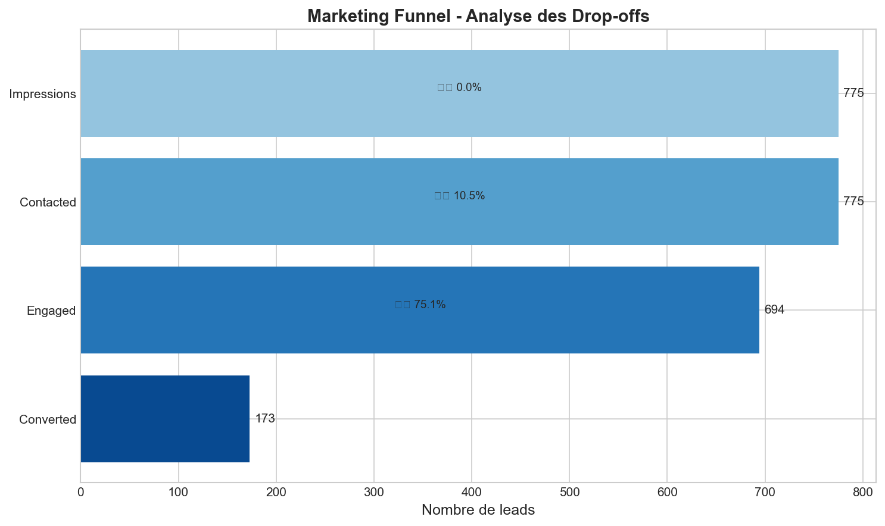
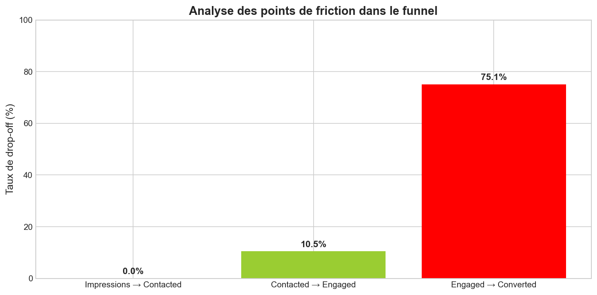
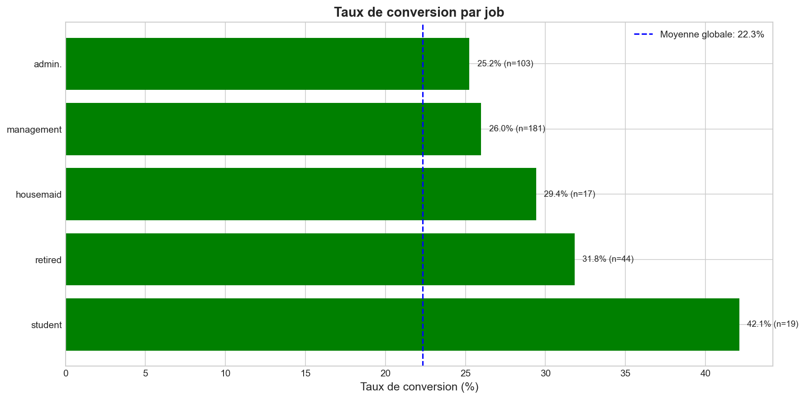
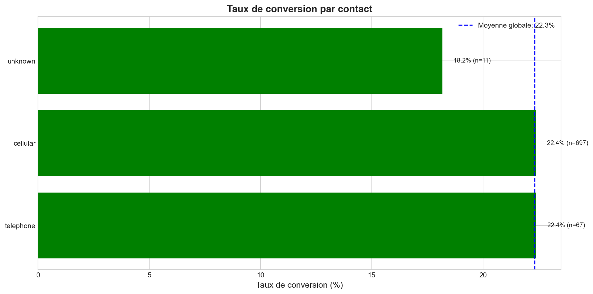
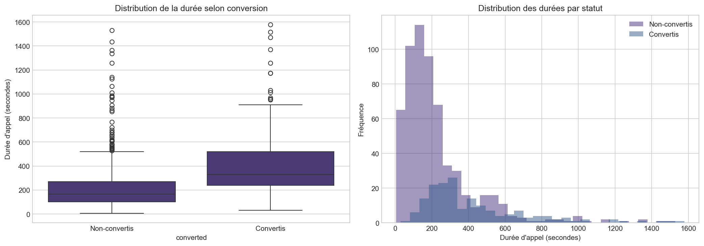

# 📊 Tableau Dashboard: Marketing Funnel

---

## 1. Funnel Principal & Points de Friction
*Ces graphiques illustrent la déperdition des opportunités tout au long de l'entonnoir de prospection.*

---

## 2. Performances Sociodémographiques
*Ce graphique identifie les segments les plus porteurs et met en évidence la surperformance des étudiants et retraités.*

---

## 3. Impact du Canal de Communication
*Ce graphique montre que la méthode de contact (Fixe vs Mobile) n'impacte pas le taux de conversion, bien que les volumes soient drastiquement différents.*

---

## 4. Analyse Comportementale : Durée d'Appel
*Ces graphiques mettent en évidence la très forte probabilité de clore une vente lorsque l'appel dépasse un certain seuil de temps (5+ minutes).*

---
*Analyse extraite via le pipelines de Data Visualization - FUTURE_DS_03*
